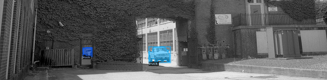

# Computer Vision SkyRemoval COCO Detectron2 Project

Link to the original colab notebook : https://colab.research.google.com/drive/1BAN0e6OBdVsgdMc09Bs7V09D2gxre5e4?usp=sharing

The main goal of the assignment is to manipulate COCO-dataset to a new one.

First, I found COCO images and annotations and added these to my projects (expanded explanation ahead).
Afterwards, I used Detectron2 by Facebook to run inference on the images. I used panoptic segmentation in order to detect the sky.
Then, I created a script to manipulate the COCO-dataset, to a new dataset without the sky, and with the correct annotations.
I removed annotations that were completely cropped off the image, and changed the image dimensions as needed.

NOTE: I thought alot about the right way to keep/ change the annotations, I also thought of creating new json files with the correct annotations and size, but I figured that changing the dataset after uploading and manipulating it (using Detectron2), will be more accurate. 

## Installation

* First, you need to download instances_val2017.json from : 

  https://www.kaggle.com/datasets/awsaf49/coco-2017-dataset

  after you finish download it, just put it in the project directory and then :
  
    `!unzip instances_val2017.json.zip > /dev/null`

* In order to download the dataset - *It is on the project*:

    `!wget http://images.cocodataset.org/zips/val2017.zip`

    `!unzip val2017.zip > /dev/null`

* In order to Install Detectron2 - *It is inside the project*

    `!pip install -U torch==1.5 torchvision==0.6 -f https://download.pytorch.org/whl/cu101/torch_stable.html` 

    `!pip install pyyaml==5.1 pycocotools>=2.0.1`

    `!gcc --version`

    `!pip install detectron2==0.1.3 -f https://dl.fbaipublicfiles.com/detectron2/wheels/cu101/torch1.5/index.html`

## The Dataset

COCO (Common Objects in Context) Dataset, is large-scale labeled image (or videos) datasets.
It contains images(jpg) and instances (json), the json files contains all the annotations and classifications of each image.
Examples of some images: 

     

## Examples Of The Data Manipulation

Before:

After: 

Before:

After: 

## Acknowledgements

 - [Detectron2 from github](https://github.com/facebookresearch/detectron2)
 - [Detectron2 documentation](https://detectron2.readthedocs.io/en/latest/)
 - [COCO dataset](https://cocodataset.org/#download)
 - [Master COCO dataset](https://towardsdatascience.com/master-the-coco-dataset-for-semantic-image-segmentation-part-1-of-2-732712631047)

